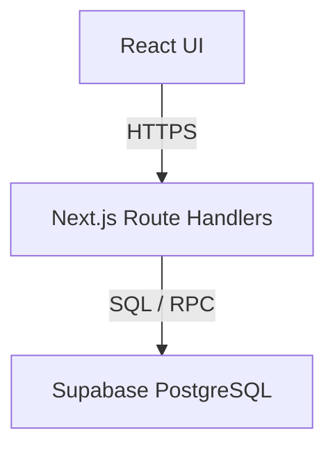

# Game Night

A community event board for tabletop-game players. Organizers post events with
a fixed number of seats; players browse upcoming events, see how full each one
is, and claim or release a seat. Seats are first-come-first-served, and an event
can never be overbooked — including when two players compete for the final seat
at the same instant.

Built as a take-home project, with an emphasis on correctness under
concurrency, maintainability, and production-oriented engineering practices.

**Hosted preview:** https://game-night-livid.vercel.app

The preview is hosted on Vercel with a hosted Supabase PostgreSQL database and
the same seeded scenarios as local development. Pick a seeded user and try to
grab the last seat.

## Architecture



The browser never accesses PostgreSQL directly. Every read and write flows
through the Next.js API. The API resolves identity from an HTTP-only cookie,
performs server-side authorization, and delegates seat allocation to database
functions that enforce capacity and idempotency under concurrency.

A component-level view is in [`doc/architecture.md`](doc/architecture.md).

## Run locally

Prerequisites: Node 20+ and Docker Desktop.

```bash
npm install
npm run setup
```

`setup` starts local Supabase, applies migrations, loads seed data, and starts
the application at http://localhost:3000.

Stop the local database afterwards with:

```bash
npx supabase stop
```

The seed data includes upcoming, full, empty, past, and one-seat-left events.
See [`doc/walkthrough.md`](doc/walkthrough.md) for a guided tour and instructions
for reproducing the last-seat race manually.

## Key design decisions

### Capacity and duplicate protection

Capacity and duplicate RSVP rules are enforced in PostgreSQL rather than in
application memory.

`rsvp_to_event` locks the event row with `SELECT ... FOR UPDATE` before checking
capacity and inserting. Concurrent requests for the same event therefore
serialize around the invariant, while requests for different events proceed
independently.

A composite primary key on `(event_id, player_id)` guarantees that retries and
double submissions cannot create duplicate RSVPs. The application role cannot
write to `rsvps` directly; it can only call the locked RSVP and cancellation
functions.

### Counts and freshness

Attendee counts are computed at read time through a database view, so they are
exact when returned. The UI remains deliberately non-optimistic: a count may
become stale between page load and click, so the RSVP result always settles
from the server response. A losing last-seat request receives `409 Conflict`
rather than briefly showing a false success.

### Identity and authorization

Authentication is intentionally simplified, as permitted by the brief. A user
selects a seeded identity, which is stored in an HTTP-only cookie.

Authorization is still enforced server-side on every request. Players cannot
create events, and organizers cannot access attendee lists for events they do
not own. Replacing the picker with a real identity provider is isolated behind
`lib/auth.ts`.

### Scaling approach

The current implementation targets launch-scale traffic while preserving an
incremental path to the brief's 12-month projections. The likely progression is:

1. Denormalize `attendee_count` onto `events`, maintained inside the same locked
   database functions.
2. Add short-TTL caching for event-list reads, where modest staleness is allowed.
3. Serve browse and detail reads from replicas while RSVP writes remain on the
   primary.
4. Add keyset pagination on `starts_at`.

The API contract and invariant-enforcement point remain unchanged throughout.

Further rationale is documented in:

- [`doc/decisions.md`](doc/decisions.md) — assumptions and product trade-offs
- [`doc/data-model-and-concurrency.md`](doc/data-model-and-concurrency.md) — schema, locking, invariants, and alternatives
- [`doc/api.md`](doc/api.md) — API surface and response behavior

## Testing

```bash
npx supabase start
npm run test:integration
```

The integration suite builds the application and exercises the real HTTP API
against PostgreSQL. It verifies that:

- 20 players racing for 5 seats produce exactly 5 successful RSVPs
- 10 players racing for 1 seat produce exactly 1 winner
- concurrent duplicate submissions create exactly one RSVP row
- cancellation immediately releases a seat for another player

The test has teeth: removing `FOR UPDATE` causes the race tests to fail, including
13 players being seated at a 5-seat event.

Additional coverage includes unit tests and Playwright end-to-end tests against
a production build. See [`doc/testing.md`](doc/testing.md).

## Time spent

Approximately 8 hours over three days, reconstructed from the commit and pull
request history.

| Work | Time |
|---|---:|
| Product thinking, data-model design, and planning | ~2 h |
| Scaffold, schema, seed data, local Supabase, and CI skeleton | ~1 h |
| API, authorization boundary, RSVP functions, and integration proof | ~1 h |
| UI states and Playwright end-to-end coverage | ~1 h |
| CI and automation-pipeline adoption | ~0.5 h |
| Hosted Supabase, Vercel deployment, and hosted smoke test | ~0.5 h |
| Dogfooding, documentation, and clean-clone verification | ~1 h |
| Final documentation with diagram | ~1 h |

The concurrency path received a disproportionate share deliberately: the schema
and locked functions were designed before any application code, and the
integration suite that proves them was written against the API contract rather
than the implementation.

## Before real traffic

In rough priority order:

1. Replace the self-asserted identity picker with real authentication and Row Level Security.

2. Add rate limiting to RSVP and cancellation endpoints.

3. Bound the lock path with `lock_timeout` and `statement_timeout` so lock contention becomes an explicit retryable failure instead of exhausting the connection pool.

4. Add production observability: structured logs, request tracing, endpoint latency/error metrics, and RSVP-specific metrics such as lock wait time, contention, and `409 event_full` rates. Alert on player-visible symptoms rather than infrastructure metrics.

5. Wire production error monitoring (Sentry or equivalent) with source maps and automatic issue creation.

6. Make production deploys automatically reversible after failed smoke tests while keeping database migrations backward compatible.

7. Add an append-only audit trail for seat claims and cancellations inside the same transaction as the RSVP update.

8. Add keyset pagination before event-list growth makes it necessary.

9. Load-test the RSVP path to establish throughput limits under realistic contention.

10. Add PITR backups, restore drills, and operational runbooks.

## AI usage

Claude Code and ChatGPT were used to accelerate implementation, documentation,
and test generation.

All architecture decisions, concurrency control, and production-critical code
were reviewed and verified manually. The CI pipeline validates the core
correctness guarantees through unit, integration, and end-to-end tests.

See [`doc/ci-and-automation.md`](doc/ci-and-automation.md) for the development
workflow, deployment pipeline, and automation boundaries.
