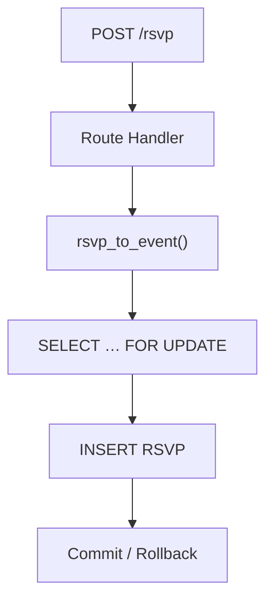
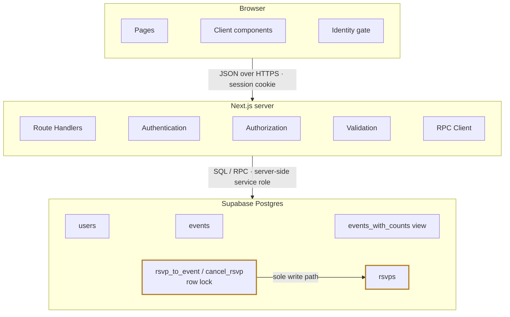

# Architecture

The browser never touches the database: every read and write crosses an HTTP
API that re-checks identity and role, and the only way a seat is ever written
is through two SQL functions that serialize on a row lock (amber below).

## Protected write path

Every seat claim takes exactly this path — there is no other way to write an
RSVP:

## Building blocks

Zooming out, the full system that write path sits inside — every component in
its tier, organized by responsibility rather than filename. The amber outline
marks the locked write path from above:

Responsibilities, not files: authentication resolves the session cookie to a
user; authorization checks role and ownership on every request; validation
rejects bad input server-side; the RPC client is the only way the server
reaches the database. Capacity (S1) and one-RSVP-per-player (S2) are enforced
inside the locked functions — the application's database role cannot write the
`rsvps` table directly, so the locked path is the only one the database leaves
open.

For the schema and the oversell race the lock prevents, see
[data-model-and-concurrency.md](data-model-and-concurrency.md); for the
endpoint-by-endpoint surface, see [api.md](api.md).
