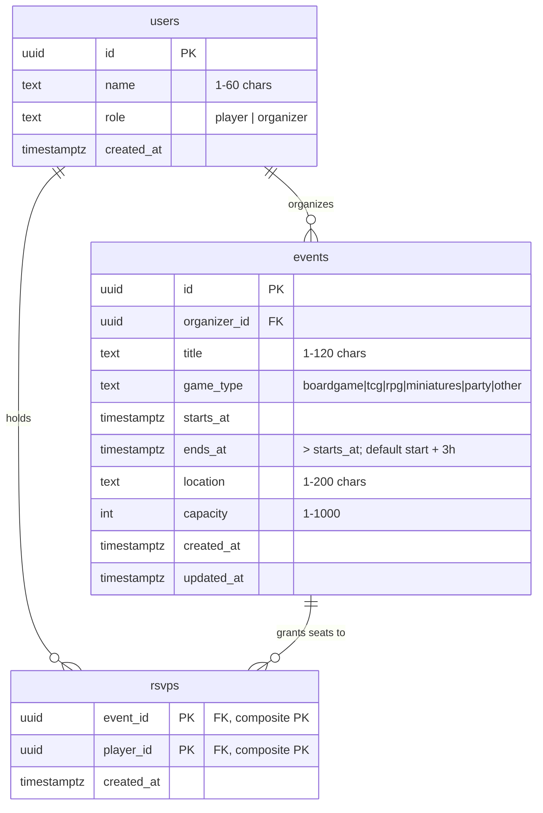

# Data model and concurrency

How Game Night stores its data, and how it guarantees that an event never
oversells a seat — including when two players go for the last one at the same
instant.

Everything here is implemented in
[`supabase/migrations/20260718000000_initial.sql`](../supabase/migrations/20260718000000_initial.sql).

## Entities

Three tables and one view. A **user** is either a player or an organizer. An
**organizer** owns events; a **player** holds RSVPs. An **RSVP** is one player's
claim on one seat at one event.



### `users`

Identity is deliberately thin. The brief does not require authentication, so a
user is a name and a role, seeded up front and chosen from a picker. `role` is
constrained to `player` or `organizer` and is what the API authorizes against —
organizers create events and read their own attendee lists, players RSVP.

There is no password, session table, or auth provider. Adding real
authentication is the first item on the hardening list in the README; the role
checks in `lib/auth.ts` are written so they keep working when identity stops
being self-asserted.

### `events`

Owned by an organizer via `organizer_id`. `capacity` is the number this whole
document exists to protect: `check (capacity between 1 and 1000)` keeps it a
sane positive integer at the storage layer, independent of any application
validation.

`game_type` is a `check` constraint rather than a Postgres `enum` — a check
constraint can be widened in a migration without the `ALTER TYPE` dance, and the
same list is mirrored in `lib/types.ts` for the UI filter.

Events carry an end time as well as a start (`ends_at > starts_at`, enforced by
a check constraint; organizers may set it, defaulting to a three-hour session).
Without it, "has it started" had to stand in for "is it over", which filed an
event running *right now* under history. The two timestamps let the product use
two different boundaries honestly: browsing lists what you can still join
(`starts_at > now` — seats close at start), while a player's "my events" lists
what they are part of and haven't finished (`ends_at > now`), so tonight's game
stays on their list while they're at the table.

Indexes:

| Index | Serves |
|---|---|
| `events_starts_at_idx` | the hot path — upcoming events, soonest first |
| `events_ends_at_idx` | a player's events, partitioned on "is it over" |
| `events_organizer_idx` | an organizer listing their own events |

`updated_at` is maintained by the `events_set_updated_at` trigger rather than by
application code, so it stays honest no matter who writes the row.

### `rsvps`

One row per player per event, and the pairing itself is the primary key:

```sql
primary key (event_id, player_id)
```

An RSVP has no identity of its own — it *is* the fact that this player holds a
seat at this event. Making that the key means the constraint enforcing S2 and
the index serving every lookup are the same object, and there is no surrogate
`id` column that nothing reads. It also drops the table from four indexes to
two: an unused primary key on `id`, plus a separate index on `event_id` that
duplicated the leftmost column of the uniqueness index, both disappear.

The remaining indexes are the primary key itself — which serves attendee lists
and counts, since `event_id` is its leading column — and `rsvps_player_idx` on
`player_id`, which "my events" needs because it is not the leading column.

The usual objection to a wide composite key doesn't apply on Postgres. In
InnoDB, secondary indexes store the primary key as their row pointer, so a wide
key inflates every other index; Postgres references heap tuples by `ctid`, so
secondary indexes pay nothing for the composite.

The trade-off is that a future table referencing a specific RSVP — door
check-ins, waitlist promotions, a payment against a seat — would need a
two-column foreign key. None of that is in scope, and adding a surrogate key
later is a small migration, whereas carrying an unused index on the largest
table in the schema is a cost paid on every write forever.

`event_id references events(id) on delete cascade` means deleting an event
releases its RSVPs. That is also how tests clean up after themselves, since they
are not permitted to delete RSVP rows directly.

### `events_with_counts` (view)

```sql
select e.*, count(r.player_id)::int as attendee_count
from events e left join rsvps r on r.event_id = e.id
group by e.id
```

Attendee counts are computed at read time, so a count is exact at the moment it
is read rather than eventually consistent. `left join` keeps events with zero
attendees in the result, and the `::int` cast avoids handing the client a
bigint-as-string.

Counting `r.player_id` rather than `*` is load-bearing: for an event with no
RSVPs the outer join produces one row of nulls, which `count(*)` would report as
an attendee. Counting a column from the right-hand table ignores those nulls and
correctly yields zero.

The view is declared `with (security_invoker = true)`. By default a Postgres
view runs with its owner's privileges, which would let a caller read through the
view around the underlying tables' row-level security. Invoker semantics make
the view respect the caller's own privileges instead.

## The invariants

Two rules from the brief, restated precisely:

- **S1 — capacity.** The number of RSVP rows for an event never exceeds that
  event's `capacity`, under any interleaving of concurrent requests.
- **S2 — one active RSVP per player per event.** A retried or double-submitted
  request never creates a duplicate row or double-counts a seat.

Both are enforced in the database. Not in the route handler, not in a service
layer, not by a lock in application memory — those all fail the moment there is
more than one server process, which at the 12-month scale in the brief there
certainly will be.

## How S1 is met

### What breaks without a lock

The naive implementation reads the count, compares it to capacity, and inserts.
Under Postgres's default `READ COMMITTED` isolation, two transactions can both
read the same count before either inserts. Capacity 4, three seats already
taken:

| | Session A | Session B | rows |
|---|---|---|---|
| t1 | `count(*)` → 3 | | 3 |
| t2 | | `count(*)` → 3 | 3 |
| t3 | 3 < 4, insert | | 4 |
| t4 | | 3 < 4, insert | **5** ← oversold |

Both sessions made a correct decision on stale information. No error is raised,
nothing looks wrong in the logs, and the fifth player shows up to a table with
four chairs.

### The mechanism

`rsvp_to_event(p_event_id, p_player_id)` takes a row lock on the event before it
reads anything:

```sql
select capacity into v_capacity
from public.events
where id = p_event_id and starts_at > now()
for update;
```

`for update` holds an exclusive lock on that event's row until the surrounding
transaction ends. A second transaction reaching the same line for the same event
blocks there until the first commits, and then proceeds with a count that
includes whatever the first one inserted. The same timeline becomes:

| | Session A | Session B | rows |
|---|---|---|---|
| t1 | locks event row | | 3 |
| t2 | | tries to lock, **waits** | 3 |
| t3 | `count(*)` → 3, insert, commit | | 4 |
| t4 | | lock acquired, `count(*)` → 4 | 4 |
| t5 | | 4 >= 4 → `event_full` | 4 |

The lock is scoped to a single event row, so RSVPs to *different* events never
contend — the serialization cost is paid only where the invariant actually
requires it.

Because the function is called as a single statement over the wire, Postgres
wraps it in an implicit transaction: the lock is acquired, the count and insert
happen, and the lock is released on commit. There is no window between the check
and the insert for another writer to slip through, and no way to leak a held
lock, since an error rolls the whole thing back.

The `starts_at > now()` predicate in the same statement means a past event fails
the lookup and returns `event_started`, so the "can't RSVP to something that
already happened" rule is enforced at the same point as capacity, not in a
separate check that could drift.

## How S2 is met

Two layers, in this order:

1. **Inside the locked function**, before the capacity check:

   ```sql
   if exists (select 1 from public.rsvps
              where event_id = p_event_id and player_id = p_player_id)
   then return 'already_rsvpd'; end if;
   ```

   Because this runs while holding the event lock, two simultaneous submissions
   from the same player serialize: the first inserts, the second sees the row
   and returns `already_rsvpd`. The retry is a no-op, not a duplicate.

2. **`primary key (event_id, player_id)`** as a hard backstop. If a future code
   path ever reached an insert without the check, the database would reject it
   rather than double-count the seat. S2 is not merely validated here, it is
   unrepresentable: a duplicate RSVP is not a row this table can hold.

### Why the duplicate check comes before the capacity check

Consider a player who already holds a seat at an event that has since filled up,
whose client retries the request (flaky network, double tap, refresh). If
capacity were checked first, they would get `event_full` — alarming and wrong,
since they *have* a seat. Checking identity first means the retry returns
`already_rsvpd`, which the API maps to a success. Idempotency is about what the
caller can safely repeat, and the ordering here is what makes the repeat safe.

## Why the application cannot bypass any of this

The rules above only hold if every write goes through the function. Rather than
rely on that as a convention, the privilege model removes the alternative:

```sql
grant select on public.rsvps to service_role;   -- note: no insert/update/delete
grant execute on function public.rsvp_to_event(uuid, uuid) to service_role;
grant execute on function public.cancel_rsvp(uuid, uuid)  to service_role;
```

The application connects as `service_role`. It can *read* RSVPs — attendee
lists, "my events", counts — but it holds no `insert`, `update`, or `delete`
privilege on the table. A route handler, a test, or a future contributor who
tries to write it directly gets `permission denied`, immediately and loudly,
instead of a subtly broken capacity check discovered in production.

The two functions are `security definer`, so they execute with their owner's
privileges and can write the table that their caller cannot. `execute` is
revoked from `public` and granted only to `service_role`, so the functions are
not a back door for anyone else. Both set `search_path = ''` and schema-qualify
every reference, which is the standard hardening for definer-rights functions.

`anon` and `authenticated` are granted nothing on any table, and row-level
security is enabled with no policies. A leaked publishable key reads nothing and
writes nothing.

## Status vocabulary

The functions return a discriminated status string rather than raising
exceptions, so the caller distinguishes outcomes without parsing error text:

| Status | Meaning |
|---|---|
| `confirmed` | seat claimed |
| `already_rsvpd` | caller already holds a seat — a safe retry |
| `event_full` | capacity reached |
| `event_started` | event is in the past |
| `event_not_found` | no such event |
| `cancelled` | seat released |
| `not_rsvpd` | nothing to release — a safe retry |

The HTTP mapping (`confirmed` → 201, `already_rsvpd` → 200, `event_full` → 409,
and so on) lands with the API in the next phase.

## Cancellation and re-RSVP

`cancel_rsvp` hard-deletes the row and reports `cancelled` or `not_rsvpd`, so
calling it twice is harmless. Deleting rather than marking a status is what lets
the pairing be the primary key at all: a `status` column would allow several
rows per player per event over time, forcing uniqueness down to a partial index
over active rows. Hard deletion keeps the key whole and makes "cancel then RSVP
again" an ordinary insert.

The trade-off: no RSVP history. The product doesn't ask for one, but an audit
trail would be worth adding before real traffic, and it belongs in the same
locked function so history and seat count can never disagree.

## Counts, freshness, and scale

Counts are exact at read time. The brief permits modest staleness; this
implementation doesn't need to spend it at launch scale, and exactness keeps the
demo and the tests unambiguous.

A count can still go stale between page load and click — someone may take the
last seat while you're reading. The server is the source of truth: the API
returns `event_full` and the UI reports that someone got there first, rather
than pretending the click succeeded.

The path to the 12-month numbers in the brief (roughly 100× read volume on the
event list) does not require rewriting any of this:

1. **Denormalize the count.** Add `events.attendee_count`, incremented and
   decremented *inside* the two functions. It cannot drift, because the
   functions already hold the event lock and are the only writers. The list
   query loses its join and becomes an index scan.
2. **Cache the list.** Short-TTL caching on the read path, which is exactly the
   "modest staleness" the brief allows, absorbs event-day spikes.
3. **Read replicas** for the list and detail reads; writes stay on the primary,
   where the lock lives.
4. **Keyset pagination** on `starts_at` once 5,000 events makes offset paging
   expensive.

Each step is additive. The API surface, the function signatures, and the
invariant enforcement point all stay where they are.

## Alternatives considered

| Approach | Why not |
|---|---|
| Check-then-insert, no lock | The oversell above. Correct-looking code, wrong under concurrency. |
| Unique constraint alone | Enforces S2 but says nothing about capacity — there is no constraint that expresses "at most N rows matching this FK". |
| `SERIALIZABLE` isolation | Would be correct, but pushes retry logic into every caller on serialization failure. More moving parts for the same guarantee. |
| Advisory lock on the event id | Works, but requires hashing a uuid into a bigint key and manual release discipline. The row lock's domain is already exactly the event. |
| Lock in application code | Breaks the moment a second server process exists — which is the whole point of the 12-month column in the brief. |
| Optimistic concurrency (version column) | Adds a retry loop and a wasted round trip per contended seat, for no gain over a lock held for microseconds. |

## Verification

Verified at the database layer while building this schema:

- Ten concurrent connections raced for three seats on one event. Result:
  exactly 3 `confirmed`, 7 `event_full`, and exactly 3 rows inserted.
- Every status path returns correctly: last seat, retry by the same player, a
  full event, a past event, an unknown event, cancel, and cancel again.
- `service_role` can call the functions but is denied a direct insert into
  `rsvps`; `anon` is denied both table reads and function execution.

The brief asks for proof at the API boundary, not just in the database. The
integration suite that fires concurrent HTTP requests at a running server — 20
players racing for 5 seats, and one player double-submitting — arrives with the
API in the next phase, and is described in the README.
