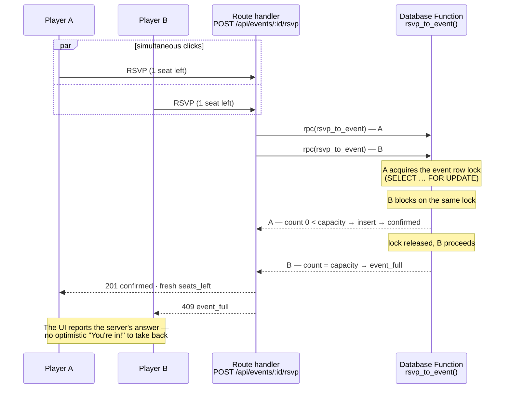
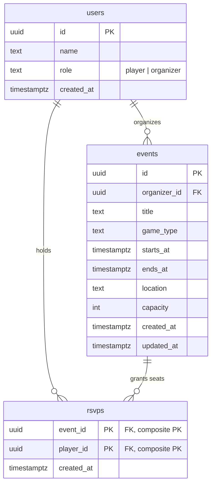

# Data model and concurrency

## Introduction

This document explains how Game Night stores its data and guarantees that an
event never oversells — including when multiple players compete for the final
seat at the same instant.

The implementation lives in
[`supabase/migrations/20260718000000_initial.sql`](../supabase/migrations/20260718000000_initial.sql).

## Concurrency Model

The hardest correctness requirement in Game Night is preventing two players
from successfully claiming the same final seat.

The browser never accesses PostgreSQL directly. Every read and write flows
through the Next.js API. The API resolves identity from an HTTP-only cookie,
performs server-side authorization, and delegates seat allocation to database
functions that enforce capacity and idempotency under concurrency.

Every RSVP follows a single protected write path through the Next.js API into
the `rsvp_to_event()` database function. The sequence diagram below illustrates
the critical race that the remainder of this document explains.



## Correctness Invariants

The design protects two rules from the assignment brief:

- **S1 — Capacity:** the number of RSVP rows for an event never exceeds its
  capacity under any interleaving of concurrent requests.
- **S2 — Uniqueness:** one player can hold at most one active RSVP for an event,
  including under retries and concurrent duplicate submissions.

Both are enforced in PostgreSQL. An application-memory lock would fail as soon
as the service runs in more than one process or region.

## Data Model

Game Night uses three tables and one read view:

- `users` represents either a player or an organizer.
- `events` belongs to an organizer and defines a fixed capacity.
- `rsvps` represents one player's claim on one seat.
- `events_with_counts` returns events with exact attendee counts.



### `users`

Authentication is intentionally out of scope for the exercise. A seeded user is
selected from a picker and stored in an HTTP-only session cookie. The `role`
constraint distinguishes players from organizers, and the API authorizes every
request against that server-resolved identity.

The identity mechanism can later be replaced with Supabase Auth or another
provider without changing the domain model or authorization checks outside
`lib/auth.ts`.

### `events`

Each event belongs to an organizer through `organizer_id`. Database constraints
protect the fields that participate in core behavior:

- `capacity` must be between 1 and 1000.
- `ends_at` must be later than `starts_at`.
- `game_type` is restricted to the supported vocabulary.

An end time is stored separately from the start time because the product needs
two different boundaries:

- browsing includes events that have not started, because those are still open
  for RSVP;
- player and organizer views include events that have started but not yet ended,
  because an in-progress event is still active.

Indexes support upcoming-event ordering, active-event filtering, and organizer
ownership queries.

### `rsvps`

An RSVP is identified by the relationship itself:

```sql
primary key (event_id, player_id)
```

This directly enforces one active RSVP per player per event and provides the
leading index needed for attendee counts and attendee lists. A separate index on
`player_id` supports the player's "My events" query.

There is no surrogate RSVP id because no in-scope entity references an RSVP as
an independent object. A future check-in, payment, or waitlist model could add
one through a migration if needed.

`event_id` uses `ON DELETE CASCADE`, so deleting an event also removes its RSVP
rows.

### `events_with_counts`

The read view computes exact attendee counts:

```sql
select e.*, count(r.player_id)::int as attendee_count
from events e
left join rsvps r on r.event_id = e.id
group by e.id;
```

The left join preserves events with no attendees. Counting `r.player_id` rather
than `*` correctly returns zero for those events.

The view uses `security_invoker = true`, so callers cannot use the view to bypass
the privileges of the underlying tables.

## Why a normal check-then-insert fails

A naive implementation reads the current count, compares it with capacity, and
then inserts. Under PostgreSQL's default `READ COMMITTED` isolation, two
transactions can observe the same count before either inserts.

Assume capacity is 4 and three seats are already taken:

| | Session A | Session B | RSVP rows |
|---|---|---|---:|
| t1 | `count(*)` → 3 | | 3 |
| t2 | | `count(*)` → 3 | 3 |
| t3 | 3 < 4, insert | | 4 |
| t4 | | 3 < 4, insert | **5** |

Each transaction made a locally valid decision using stale information, and the
event oversold without producing an error.

## How S1 works

`rsvp_to_event(p_event_id, p_player_id)` locks the target event before reading
capacity or RSVP state:

```sql
select capacity into v_capacity
from public.events
where id = p_event_id
  and starts_at > now()
for update;
```

`FOR UPDATE` holds an exclusive lock on that event row until the surrounding
transaction commits or rolls back. A second RSVP for the same event waits at the
lock, then re-evaluates capacity after the first transaction is visible.

| | Session A | Session B | RSVP rows |
|---|---|---|---:|
| t1 | locks event row | | 3 |
| t2 | | attempts lock and waits | 3 |
| t3 | count → 3, insert, commit | | 4 |
| t4 | | acquires lock, count → 4 | 4 |
| t5 | | returns `event_full` | 4 |

The lock is scoped to one event row. RSVPs for different events do not contend;
serialization occurs only where the invariant requires it.

The function is invoked as a single database statement, so PostgreSQL wraps the
lock, count, and insert in one transaction. There is no gap between checking
capacity and claiming the seat.

The `starts_at > now()` predicate also closes RSVPs at the start time from the
same enforcement point rather than relying on a separate application check.

## How S2 works

S2 uses two layers.

First, while holding the event lock, the function checks whether the player
already has a seat:

```sql
if exists (
    select 1
    from public.rsvps
    where event_id = p_event_id
      and player_id = p_player_id
) then
    return 'already_rsvpd';
end if;
```

Two simultaneous submissions from the same player serialize on the event lock.
The first inserts; the second sees the existing row and returns an idempotent
success status.

Second, the composite primary key is a hard database backstop. Even if a future
code path omits the explicit check, PostgreSQL cannot represent two rows with the
same `(event_id, player_id)` pair.

### Why the duplicate check runs first

Consider a player who already holds a seat in an event that has since filled up.
A retry should return `already_rsvpd`, not `event_full`, because the player still
has a valid seat.

Checking ownership before capacity makes the operation safely repeatable and
prevents a successful RSVP from appearing to fail during a network retry or
double submission.

## Preventing application bypass

The locking design is useful only if every write goes through the protected
functions. The privilege model removes the unsafe alternative:

```sql
grant select on public.rsvps to service_role;
grant execute on function public.rsvp_to_event(uuid, uuid) to service_role;
grant execute on function public.cancel_rsvp(uuid, uuid) to service_role;
```

The application role can read `rsvps`, but it has no direct `INSERT`, `UPDATE`,
or `DELETE` privilege. Route handlers, tests, or future contributors attempting
a direct write receive `permission denied` rather than silently bypassing the
capacity rule.

The two write functions use `SECURITY DEFINER` so they can modify the protected
table on behalf of the application. Execution is revoked from `public`, granted
only to `service_role`, and the functions use an empty `search_path` with
schema-qualified references.

The browser-facing `anon` and `authenticated` roles receive no table access.
Row-level security remains enabled with no permissive policies, so a leaked
publishable key cannot read or write application data directly.

## Cancellation and re-RSVP

`cancel_rsvp` deletes the active row and returns either `cancelled` or
`not_rsvpd`, making repeated cancellation safe.

Hard deletion keeps the composite primary key simple and makes cancellation
followed by re-RSVP an ordinary insert. The trade-off is that RSVP history is
not preserved. Before real traffic, cancellation history should be written to
an audit table inside the same transaction so seat state and audit state cannot
diverge.

## Counts, freshness, and scale

Counts are exact at read time. The assignment permits modest staleness, but the
launch-scale workload does not require it, and exact counts keep behavior and
tests unambiguous.

A displayed count can still become stale before the user clicks RSVP. The server
remains authoritative: if another player claims the final seat first, the API
returns `event_full` and the UI reports the conflict instead of showing an
optimistic success that must later be reversed.

The path toward the projected 12-month read volume is additive:

1. Add `events.attendee_count`, updated inside the locked RSVP and cancellation
   functions so it cannot drift.
2. Add short-TTL caching to the list endpoint, using the modest staleness budget
   where it provides the most value.
3. Serve list and detail reads from replicas while writes and locks remain on the
   primary.
4. Add keyset pagination on `starts_at` when event volume warrants it.

None of these steps changes the API contract, function signatures, or invariant
enforcement point.

## Alternatives considered

| Approach | Why it was not selected |
|---|---|
| Check-then-insert without a lock | Oversells under concurrent requests even though each request appears correct. |
| Unique constraint alone | Enforces one RSVP per player but cannot express a per-event capacity limit. |
| `SERIALIZABLE` isolation | Correct, but requires callers to detect and retry serialization failures. |
| Advisory lock on event id | Works, but adds manual key derivation and lock discipline when the event row is already the natural lock target. |
| Application-process lock | Fails when more than one server instance handles requests. |
| Optimistic version column | Adds retry loops and extra round trips without improving the guarantee for this workload. |

## Verification

The API-level integration suite exercises these rules through concurrent HTTP
requests against a running application and real PostgreSQL instance. It proves
that the service does not overbook, duplicate RSVPs remain idempotent, and
cancellation makes a seat immediately available.

Removing `FOR UPDATE` causes the race tests to fail, demonstrating that the
suite detects the exact concurrency bug the design is intended to prevent.

See [`testing.md`](testing.md) for the full unit, integration, end-to-end, and CI
strategy.
